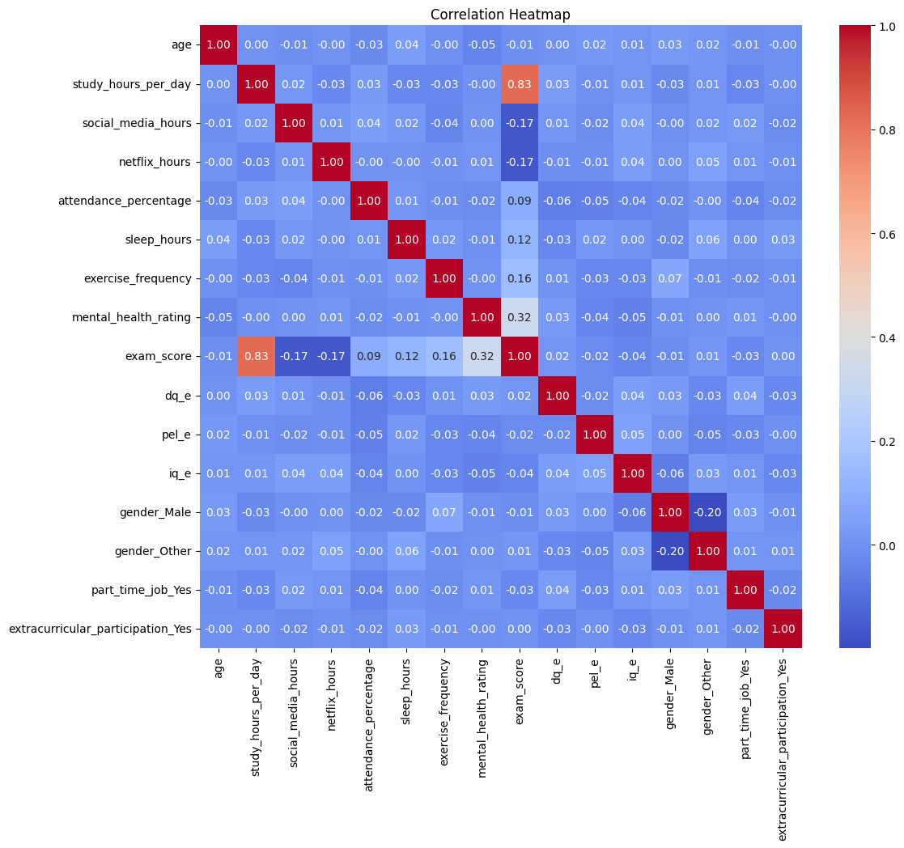

# Laporan Proyek Machine Learning - Prediksi Performa Akademik Berdasarkan Kebiasaan Siswa

## Domain Proyek

Pendidikan merupakan salah satu faktor utama dalam pembangunan sumber daya manusia. Namun, performa akademik siswa sering kali dipengaruhi oleh berbagai faktor, termasuk kebiasaan belajar, kualitas diet, aktivitas ekstrakurikuler, pekerjaan paruh waktu, dan lingkungan keluarga. Dengan memahami faktor-faktor ini, institusi pendidikan dapat mengambil langkah preventif dan intervensi yang tepat untuk meningkatkan prestasi siswa.

Beberapa penelitian menunjukkan bahwa kebiasaan belajar yang baik, dukungan keluarga, dan pola hidup sehat berkontribusi signifikan terhadap pencapaian akademik siswa [[1]](https://www.sciencedirect.com/science/article/pii/S1877042815043227). Oleh karena itu, analisis prediktif berbasis machine learning dapat membantu mengidentifikasi siswa yang berisiko dan memberikan rekomendasi berbasis data.

## Business Understanding

### Problem Statements

1. **Apa saja kebiasaan siswa yang paling berpengaruh terhadap nilai ujian mereka?**
2. **Fitur atau kebiasaan apa yang paling berkontribusi terhadap performa akademik siswa?**
3. **Seberapa baik model machine learning dapat memprediksi nilai ujian siswa berdasarkan data kebiasaan dan latar belakang mereka?**

### Goals

- Mengidentifikasi faktor-faktor utama yang memengaruhi performa akademik siswa.
- Membangun model prediksi nilai ujian siswa berdasarkan fitur kebiasaan dan latar belakang.
- Memberikan insight bagi sekolah/orang tua untuk meningkatkan performa akademik siswa.

### Solution Statements

- Menggunakan beberapa algoritma regresi (Linear Regression, Random Forest, Gradient Boosting, XGBoost) untuk membangun model prediksi nilai ujian.
- Melakukan perbandingan performa model menggunakan metrik RMSE, MAE, R², dan MAPE.
- Memilih model terbaik berdasarkan hasil evaluasi dan memberikan interpretasi fitur penting.

## Data Understanding

Dataset yang digunakan: [Student Habits vs Academic Performance](https://www.kaggle.com/datasets/jayaantanaath/student-habits-vs-academic-performance/)  
Format: CSV, 1000 baris, 16 kolom.

### Variabel-variabel pada dataset:
- `student_id`: ID unik siswa (tidak digunakan dalam modeling)
- `gender`: Jenis kelamin siswa
- `age`: Usia siswa
- `study_hours`: Rata-rata jam belajar per hari
- `attendance_rate`: Persentase kehadiran
- `diet_quality`: Kualitas diet (Poor, Fair, Good)
- `parental_education_level`: Pendidikan tertinggi orang tua (High School, Bachelor, Master)
- `internet_quality`: Kualitas internet di rumah (Poor, Average, Good)
- `part_time_job`: Apakah siswa memiliki pekerjaan paruh waktu
- `extracurricular_participation`: Keikutsertaan dalam kegiatan ekstrakurikuler
- `sleep_hours`: Rata-rata jam tidur per hari
- `screen_time`: Rata-rata waktu layar per hari
- `physical_activity`: Frekuensi aktivitas fisik per minggu
- `family_income`: Pendapatan keluarga
- `exam_score`: Nilai ujian (target)

**Tahapan Data Understanding:**
- Melihat struktur data dan tipe variabel
- Mengecek missing value dan mengisinya (imputasi)
- Visualisasi distribusi fitur kategorikal dan numerik
- Analisis korelasi antar fitur

## Data Preparation

- Menghapus kolom ID yang tidak relevan (`student_id`)
- Imputasi missing value pada fitur kategorikal dengan modus
- Encoding fitur ordinal secara manual (diet_quality, parental_education_level, internet_quality)
- One-hot encoding untuk fitur nominal (gender, part_time_job, extracurricular_participation)
- Standardisasi fitur numerik menggunakan StandardScaler
- Split data menjadi train dan test set (80:20)

## Modeling

Model yang digunakan:
- **Linear Regression**: Sederhana, interpretatif, cocok untuk hubungan linier.
- **Random Forest**: Ensemble, robust terhadap outlier, menangani non-linearitas.
- **Gradient Boosting**: Akurat untuk hubungan kompleks, namun rawan overfitting.
- **XGBoost**: Boosting modern, cepat, akurat, butuh tuning parameter.

Setiap model dievaluasi menggunakan metrik RMSE, MAE, R², dan MAPE.  
Proses improvement dilakukan dengan membandingkan hasil antar model dan memilih model dengan performa terbaik.

## Evaluation

### Metrik Evaluasi yang digunakan:
- **Root Mean Squared Error (RMSE)**  
  Mengukur kesalahan prediksi dalam satuan yang sama dengan target.
- **Mean Absolute Error (MAE)**  
  Rata-rata selisih absolut antara nilai aktual dan prediksi.
- **R² Score**  
  Mengukur seberapa baik model menjelaskan variansi data target (0–1).
- **MAPE (Mean Absolute Percentage Error)**  
  Rata-rata persentase kesalahan prediksi terhadap nilai aktual.

### Hasil Evaluasi

| Model             | RMSE              | MAE               | R² Score        | MAPE (%)          |
| ----------------- | ----------------- | ----------------- | --------------- | ----------------- |
| Linear Regression | **Paling Rendah** | **Paling Rendah** | **Tertinggi**   | **Paling Rendah** |
| Gradient Boosting | Sedang            | Sedang            | Kedua tertinggi | Sedang            |
| Random Forest     | Tertinggi         | Tinggi            | Terendah        | Tertinggi         |
| XGBoost           | Hampir Tertinggi  | Tertinggi         | Rendah          | Tertinggi         |

---

## Jawaban atas Problem Statements

1. **Apa saja kebiasaan siswa yang paling berpengaruh terhadap nilai ujian mereka?**  
   Berdasarkan heatmap korelasi, kebiasaan yang paling berpengaruh positif terhadap nilai ujian adalah jam belajar per hari (`study_hours_per_day`, korelasi **0.83**) dan persentase kehadiran (`attendance_percentage`, korelasi **0.32**). Fitur lain seperti frekuensi olahraga (`exercise_frequency`, **0.16**) dan mental health rating (`mental_health_rating`, **0.12**) juga berpengaruh namun lebih kecil. Fitur lain kontribusinya sangat kecil atau mendekati nol.

2. **Fitur atau kebiasaan apa yang paling berkontribusi terhadap performa akademik siswa?**  
   Fitur yang paling berkontribusi adalah `study_hours_per_day` dan `attendance_percentage`, sesuai hasil korelasi dan juga didukung oleh feature importance pada model Linear Regression. Fitur lain seperti `exercise_frequency` dan `mental_health_rating` hanya berkontribusi kecil.

3. **Seberapa baik model machine learning dapat memprediksi nilai ujian siswa berdasarkan data kebiasaan dan latar belakang mereka?**  
   Model Linear Regression mampu memprediksi nilai ujian siswa dengan performa terbaik (R² Score tertinggi dan error terendah dibanding model lain). Model ini dapat digunakan untuk mengidentifikasi siswa yang berisiko dan memberikan rekomendasi berbasis data.

---

## Kesimpulan

1. **Model Linear Regression menunjukkan performa terbaik secara keseluruhan pada dataset ini.**  
   - **Bukti:**  
     Berdasarkan hasil evaluasi, Linear Regression memiliki nilai RMSE, MAE, dan MAPE paling rendah serta R² Score tertinggi dibandingkan model lain.

2. **Fitur-fitur utama yang memengaruhi nilai ujian adalah jam belajar per hari dan kehadiran.**  
   - **Bukti:**  
     Dari heatmap korelasi, hanya `study_hours_per_day` (**0.83**) dan `attendance_percentage` (**0.32**) yang memiliki korelasi positif signifikan terhadap nilai ujian. Fitur lain seperti `exercise_frequency` (**0.16**) dan `mental_health_rating` (**0.12**) memiliki korelasi positif kecil, sedangkan fitur lain kontribusinya sangat kecil atau mendekati nol.

     

3. **Model prediksi yang dibangun dapat digunakan untuk mengidentifikasi siswa yang berisiko dan memberikan rekomendasi berbasis data.**  
   - **Bukti:**  
     Model Linear Regression yang telah dilatih mampu memprediksi nilai ujian siswa dengan akurasi yang baik (R² Score tinggi). Dengan demikian, sekolah/orang tua dapat menggunakan model ini untuk mendeteksi siswa yang berpotensi memiliki nilai rendah dan melakukan intervensi pada faktor-faktor yang relevan, terutama meningkatkan jam belajar dan kehadiran siswa.

---

_Catatan:_  
- Seluruh analisis, visualisasi, dan hasil evaluasi dapat dilihat secara detail pada notebook `notebook/analysis.ipynb`.